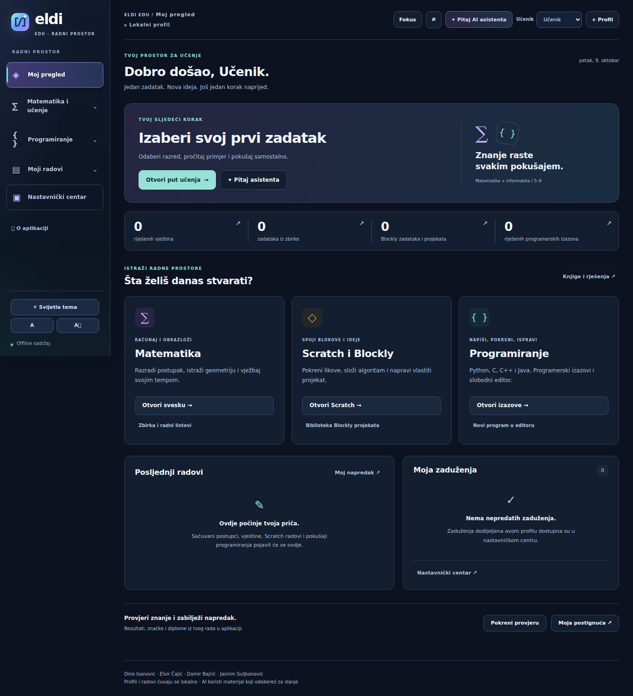
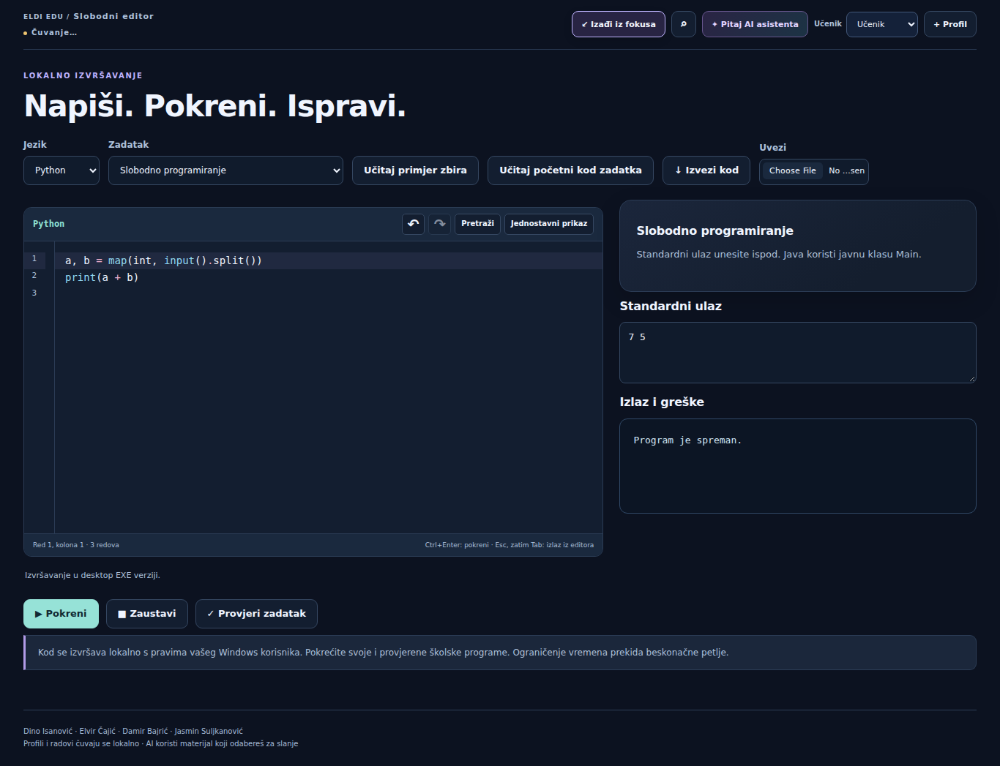

# Dorada desktop radnog prostora

Razvojna grana `codex/desktop-workspace-refresh`, zasnovana na `8805ba9850ad96fcd16f382494ebc465e9c0b6b2`. Verzija paketa ostaje 11.0.1 do pripreme novog izdanja. Ovo nije objavljeno Windows izdanje.

## Promjene koje se mogu isprobati

| Dio aplikacije | Novo ponašanje |
|---|---|
| Moj pregled | Stvarni brojevi riješenih vještina, zbirke, Blockly rada i programerskih izazova; nedovršena primljena zaduženja; četiri posljednja rada. |
| Nastavi rad | Otvara sačuvani matematički postupak, vještinu, predati programerski zadatak ili Scratch projekat. Rad na nezavršenoj vještini uzima se u obzir preko postojećeg vremena izmjene. |
| Navigacija | Tri sklopive grupe, stalni pristup pregledu i nastavničkom centru, svih 18 postojećih odjeljaka. Aktivna grupa se automatski otvara. |
| Fokus | Dugme i F9 sklanjaju vanjski izbornik i sporedne panele sveske/izazova. Ponovni F9 ili Escape vraća raspored. Escape prvo zatvara otvorenu pretragu editora ili dijalog. |
| Programski editor | CodeMirror 6 u slobodnom editoru i programerskim izazovima: Python/C/C++/Java sintaksa, brojevi redova, zagrade, uvlačenje, pretraga, undo/redo, red i kolona, Ctrl+Enter. Sve datoteke su lokalne. |
| Jednostavni prikaz | Vraća postojeći tekstualni unos, uz isti nacrt i automatsko čuvanje. |
| Status čuvanja | Pokazuje stvarno čekanje, uspjeh ili grešku zapisa u postojeću lokalnu bazu. |
| Raspored | Tamna i svijetla tema, uži ekran i postojeća opcija većeg teksta. Štampa ostaje odvojena od ekranskog rasporeda. |

Brojači ne dodaju demonstracione rezultate. Historija editora se resetuje pri promjeni dokumenta/jezika kako undo ne bi prenio kod iz drugog zadatka. Namjerno prazan nacrt ostaje prazan. Nije promijenjena shema profila, način izvršavanja koda ili protokol AI asistenta.

## Stvarni snimci interfejsa

Snimljeno iz desktop renderera u Chromiumu, bez nacrtanog interfejsa ili izmišljenih rezultata. Prvi ekran koristi nov profil. Snimci nisu dokaz provjere zapakovane Windows aplikacije.





## Provjere

- Testna serija bez `scratch.test.cjs`: 270 uspješnih, 1 preskočen, 0 neuspješnih testova. Scratch bundle nije izgrađen u ovom okruženju.
- Nakon završne dorade: sva 4 testa `workspace-summary.test.cjs` prolaze, uključujući nedovršene vještine i deduplikaciju.
- `tests/workspace-ui.cjs` provjerava stvarne klikove i unos, čuvanje i ponovno učitavanje, odvajanje profila, prazan nacrt, jezike i zadatke, undo, pretragu, jednostavni unos, programsko postavljanje vrijednosti i read-only stanje.
- Ista provjera pokreće stvarni Python program prečicom Ctrl+Enter kroz postojeći lokalni runner i provjerava rezultat 12 za ulaz 7 5.
- Pet stranica (pregled, sveska, izazovi, editor i nastavnik) provjereno na 1366×768, 1093×614 i 911×512 CSS piksela: bez vodoravnog prelijevanja dokumenta. Ovo predstavlja raspoloživi prostor pri približno 100/125/150% na ekranu širine 1366, a ne zaseban Windows DPI test.
- JavaScript sintaksa i `git diff --check` prolaze.

Za ponavljanje UI testa potrebni su Playwright s Chromiumom i sistemski Python. Može se zadati `ELDI_CHROMIUM_PATH` za drugi Chromium executable; `CODEX_PRIMARY_RUNTIME_NODE_MODULES` je opcioni fallback za Playwright. Prije toga pripremiti sadržaj i editor:

```sh
npm ci
npm run editor:bundle
node scripts/generate-content.cjs
node scripts/build-learning-pack.cjs
node scripts/build-block-projects.cjs
node scripts/build-block-pack.cjs
node scripts/build-assessment-pack.cjs
node --test tests/workspace-summary.test.cjs
node tests/workspace-ui.cjs
```

## Prije novog javnog izdanja

Preostaju puni Windows build, desktop/packaged smoke testovi i Scratch integracijska provjera. Postojeći workflow objavljuje `v11.0.1` i pri pushu na main: prvo treba uskladiti novu verziju i napomene izdanja da se postojeći paket ne prepiše nazivom starog izdanja. Ova grana ne mijenja workflow, hosting ni website paket.

Izvor editora: `renderer/editor/source.js`; reproducibilni lokalni bundle: `npm run editor:bundle`. `npm start` i `npm run check` ga obnavljaju. Licence svih 22 ugrađenih paketa nalaze se u `renderer/vendor/ELDI-EDITOR-NOTICES.txt`.
